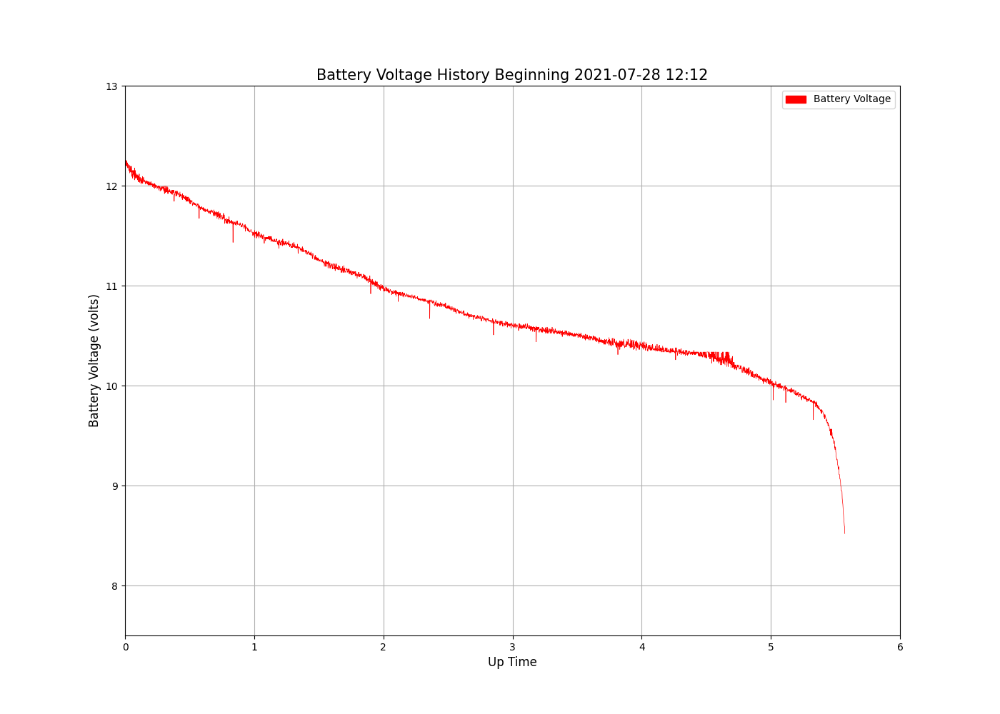

# Log Value And Print (Rosbot Dave Version)

GoPiGo3 project to monitor battery voltage, and generate plot a "life" 

Example battery till shutdown plot:  

  

**Introduction:**  

- To run:
  python(3) logBattV.py    
  ./logBattV.py   
  ./logBattV.py > logBattV.out 2>&1 &
  
  ./plotBattLife.py  battV/csv/battV-YYYYMMDD-HHMM.csv
 
- logBattV.py:  Checks battery voltage periodically, and writes value to csv file  
- tillShutdownLife.py: Logs battery voltage all the way down till battery protection circuit
  jerks the power off.  Warning - may corrupt SDcard so have a backup. 
- plotBattLife.py:  Creates a graphic of voltage vs up time in battLife-<date>-<time>.png  

- .csv files are written to      <base_folder>/battV/csv/         (created if not existing)  
- .png plot files are written to <base_folder>/battV/pic/         (created if not existing)  

**Hardware:**  
- Raspberry Pi 3B+ running with Ubuntu 20.04.
- DexterIndustries GoPiGo3
- DexterIndustries/ModularRobotics 3000mA 11.1v Li-Ion Battery
- DexterIndustries/ModularRobotics 120v 1A Li-Ion Battery Charger
  
**Installation:**  
- If desire output in a specific place, set base_dir variable:  ./ is the default
- Ascertain DIODE_DROP value to make get_battery_voltage()+DIODE_DROP=Actual Battery Voltage

Packages needed to be installed:  
-matplotlib  (sudo pip3 install matplotlib)  
-plotly  

  
